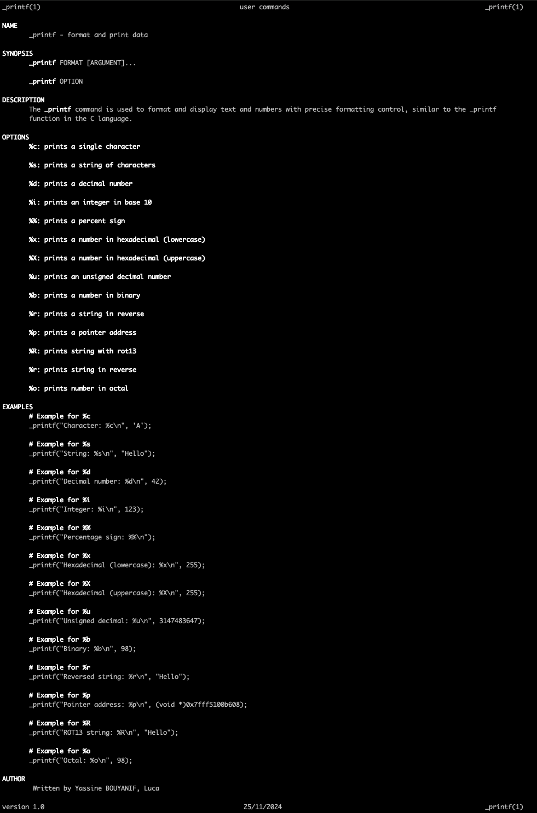

# printf Project

## Description
This project is an implementation of the `printf` function in C. It was developed by Luca and Yassine as part of the Holberton School curriculum.

## Requirements

- Allowed editors: vi, vim, emacs
 - All your files will be compiled on Ubuntu 20.04 LTS using gcc, using the options -Wall -Werror -Wextra -pedantic -std=gnu89
- All your files should end with a new line
- Your code should use the Betty style. It will be checked using betty-style.pl and betty-doc.pl
- You are not allowed to use global variables
- No more than 5 functions per file

## Authorized functions and macros
- write (man 2 write)
- malloc (man 3 malloc)
- free (man 3 free)
- va_start (man 3 va_start)
- va_end (man 3 va_end)
- va_copy (man 3 va_copy)
- va_arg (man 3 va_arg)

## Flow Chart


## Man _printf



## Conversion Specifiers
- `%c` : Prints a single character.
- `%s` : Prints a string of characters.
- `%d` : Prints a decimal (base 10) number.
- `%i` : Prints an integer in base 10.
- `%u` : Prints an unsigned decimal (base 10) number.
- `%x` : Prints a number in hexadecimal (base 16) lowercase.
- `%X` : Prints a number in hexadecimal (base 16) uppercase.
- `%p` : Prints a pointer address.
- `%%` : Prints a percent sign.
- `%r` : Prints the reversed string.
- `%R` : Prints the ROT13 string.
- `%b` : Prints a binary number.
- `%o` : Prints an octal number.

## How to Run
To compile and run the project, use the following commands:

```sh
gcc -Wall -Werror -Wextra -pedantic -std=gnu89 *.c -o printf
./printf
```

## Makefile

To simplify the compilation process, you can use a Makefile. Here is an example of a Makefile for this project:

```Makefile
CC = gcc
CFLAGS = -Wall -Werror -Wextra -pedantic -std=gnu89
SRC = $(wildcard *.c)
OBJ = $(SRC:.c=.o)
TARGET = printf

all: $(TARGET)

$(TARGET): $(OBJ)
    $(CC) $(CFLAGS) -o $@ $^

clean:
    rm -f $(OBJ) $(TARGET)

.PHONY: all clean
```

To use the Makefile, run the following commands:

1. Compile the project:
    ```sh
    make
    ```

2. Clean the project:
    ```sh
    make clean
    ```

## How to use

To use the `printf` function in your code, follow these steps:

1. Include the header file in your source code:
    ```c
    #include "main.h"
    ```

2. Use the `printf` function as you would with the standard library `printf`:
    ```c
    int main(void)
    {
        _printf("Hello, World!\n");
        return (0);
    }
    ```

## Betty Coding Style
This project follows the Betty coding style. To check your code against the Betty style, you can use the following commands:

1. Install Betty:
    ```sh
    git clone https://github.com/holbertonschool/Betty.git
    cd Betty
    sudo ./install.sh
    ```

2. Run Betty on your code:
    ```sh
    betty *.c *.h
    ```

## GCC Version
This project is intended to be compiled with GCC version 4.8.4 or later.

## Authors
- Luca
- Yassine
