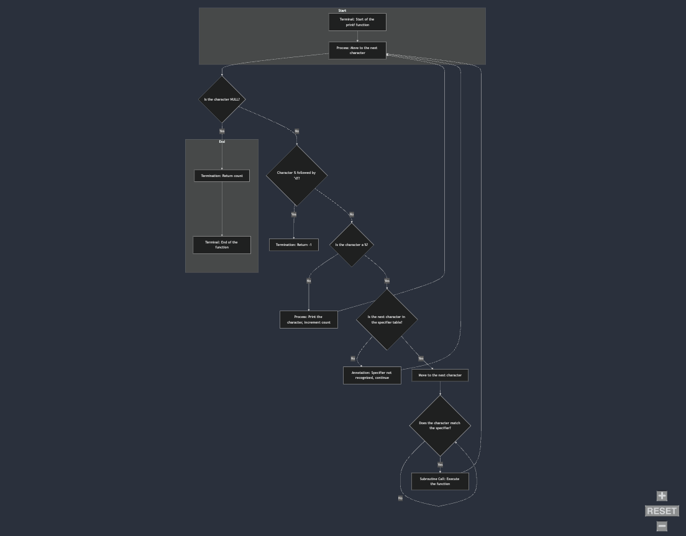

# printf Project

## Description
This project is an implementation of the `printf` function in C. It was developed by Luca and Yassine as part of the Holberton School curriculum.

## Requirements

- Allowed editors: vi, vim, emacs
 - All your files will be compiled on Ubuntu 20.04 LTS using gcc, using the options -Wall -Werror -Wextra -pedantic -std=gnu89
- All your files should end with a new line
A README.md file, at the root of the folder of the project is mandatory
- Your code should use the Betty style. It will be checked using betty-style.pl and betty-doc.pl
- You are not allowed to use global variables
- No more than 5 functions per file
- In the following examples, the main.c files are shown as examples. You can use them to test your functions, but you don’t have to push them to your repo (if you do we won’t take them into account). We will use our own main.c files at compilation; do not push your own main.c file. Our main.c files might be different from the one shown in the examples
- The prototypes of all your functions should be included in your header file called main.h
- Don’t forget to push your header file
- All your header files should be include guarded
- Note that we will not provide the _putchar function for this project

## Authorized functions and macros
- write (man 2 write)
- malloc (man 3 malloc)
- free (man 3 free)
- va_start (man 3 va_start)
- va_end (man 3 va_end)
- va_copy (man 3 va_copy)
- va_arg (man 3 va_arg)

## Flow Chart



## Conversion Specifiers

- `%c` : Prints a single character.
- `%s` : Prints a string of characters.
- `%d` : Prints a decimal (base 10) number.
- `%i` : Prints an integer in base 10.
- `%u` : Prints an unsigned decimal (base 10) number.
- `%x` : Prints a number in hexadecimal (base 16) lowercase.
- `%X` : Prints a number in hexadecimal (base 16) uppercase.
- `%p` : Prints a pointer address.
- `%%` : Prints a percent sign.

## How to Run
To compile and run the project, use the following commands:

```sh
gcc -Wall -Werror -Wextra -pedantic -std=gnu89 *.c -o printf
./printf
```

## Betty Coding Style
This project follows the Betty coding style. To check your code against the Betty style, you can use the following commands:

1. Install Betty:
    ```sh
    git clone https://github.com/holbertonschool/Betty.git
    cd Betty
    sudo ./install.sh
    ```

2. Run Betty on your code:
    ```sh
    betty *.c *.h
    ```

## GCC Version
This project is intended to be compiled with GCC version 4.8.4 or later.

## Authors
- Luca
- Yassine